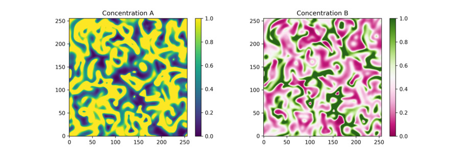
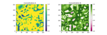

# Turing



## Purpose
Perform a reaction-diffusion simulation to produce Turing patterns.

## Demo simulation
See `demo.sh` to perform a simulation.

## Detailed usage instructions
Example execution:
```
../build/turing --Da 2e-5 --Db 1e-5 --dx 0.005 --dt 0.01 --width 256 --height 256 \
--steps 100 --tsteps 100 --outfile "data.bin" --reaction lotka-volterra \
--parameters "alpha=2.3333;beta=2.6666;gamma=1.0;delta=1.0"
```

Parameter description:
* `Da` - Diffusion coefficient of compound A
* `Db` - Diffusion coefficient of compound B
* `dx` - Spatial distance in discretization
* `dt` - Time in discretization
* `width` - Number of grid points in the x direction
* `height` - Number of grid points in y direction
* `steps` - Number of frames to generate
* `tsteps` - Number of time steps between frames
* `outfile` - File to write the frames to (binary)
* `reaction` - Which reaction system to use (see below)
* `parameters` - List of parameters to parse to the reaction system (see below)

## Reaction systems

Choose between:
* `lotka-volterra`
* `gierer-meinhardt`
* `gray-scott`
* `fitzhugh-nagumo`

### Lotka-Volterra
Default parameter string:
```
"alpha=2.3333;beta=2.6666;gamma=1.0;delta=1.0"
```



### Gierer-Meinhardt

### Gray-Scott

### Fitzhugh-Nagumo

## Compilation
```
mkdir build
cd build
cmake ../src
make -j5
```
