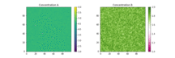
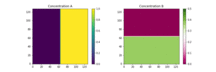

# Turing


## Purpose
Perform a reaction-diffusion simulation using a variety of reaction models. Appropriate initial conditions are automatically set.

## Demo simulation
See the selection of demo scripts in the `scripts` folder.

## Detailed usage instructions
Example execution:
```
../build/turing --Da 2e-5 --Db 1e-5 --dx 0.005 --dt 0.01 --width 256 --height 256 \
--steps 100 --tsteps 100 --outfile "data.bin" --reaction lotka-volterra \
--parameters "alpha=2.3333;beta=2.6666;gamma=1.0;delta=1.0"
```

Parameter description:
* `Da` - Diffusion coefficient of compound A
* `Db` - Diffusion coefficient of compound B
* `dx` - Spatial distance in discretization
* `dt` - Time in discretization
* `width` - Number of grid points in the x direction
* `height` - Number of grid points in y direction
* `steps` - Number of frames to generate
* `tsteps` - Number of time steps between frames
* `outfile` - File to write the frames to (binary)
* `reaction` - Which reaction system to use (see below)
* `parameters` - List of parameters to parse to the reaction system (see below)
* `pbc` - Whether to use periodic boundary conditions (if not, zero-flux boundary conditions are used)

## Reaction systems

Choose between:
* `lotka-volterra`
* `gierer-meinhardt`
* `gray-scott`
* `fitzhugh-nagumo`
* `brusselator`
* `barkley`

### Lotka-Volterra
Example execution:
```
../build/turing --Da 2e-5 --Db 1e-5 --dx 0.005 --dt 0.01 --width 256 --height 256 \
--steps 100 --tsteps 100 --outfile "data.bin" --reaction lotka-volterra \
--parameters "alpha=2.3333;beta=2.6666;gamma=1.0;delta=1.0" --pbc
```


### Fitzhugh-Nagumo
Example execution:
```
../build/turing --Da 1 --Db 100 --dx 1.0 --dt 0.001 --width 100 --height 100 \
--steps 20 --tsteps 1000 --outfile "data.bin" --reaction fitzhugh-nagumo \
--parameters "alpha=-0.005;beta=10.0" --pbc
```

Fitzhugh-Nagumo converges to a **steady-state solution**.


### Gray-Scott
Example execution:
```
../build/turing --Da 2e-5 --Db 1e-5 --dx 0.005 --dt 0.1 --width 256 --height 256 \
--steps 20 --tsteps 1000 --outfile "data.bin" --reaction gray-scott \
--parameters "f=0.06;k=0.0609" --pbc
```

Gray-Scott converges to a **steady-state solution**.


### Brusselator
Example execution:
```
../build/turing --Da 2 --Db 16 --dx 1.0 --dt 0.001 --width 100 --height 100 \
--steps 100 --tsteps 1000 --outfile "data.bin" --reaction brusselator \
--parameters "alpha=4.5;beta=7.50" --pbc
```

Brusselator converges to a **steady-state solution**.



## Compilation
```
mkdir build
cd build
cmake ../src
make -j5
```

### Barkley
Example execution:
```
../build/turing --Da 5.0 --Db 0.0 --dx 1.0 --dt 0.001 --width 128 --height 128 \
--steps 20 --tsteps 1000 --outfile "data.bin" --reaction barkley \
--parameters "alpha=0.75;beta=0.06;epsilon=50.0"
```

Barkley shows spirals or chaotic behavior (epsilon = 13, other variables are kept the same)




## Compilation
```
mkdir build
cd build
cmake ../src
make -j5
```
